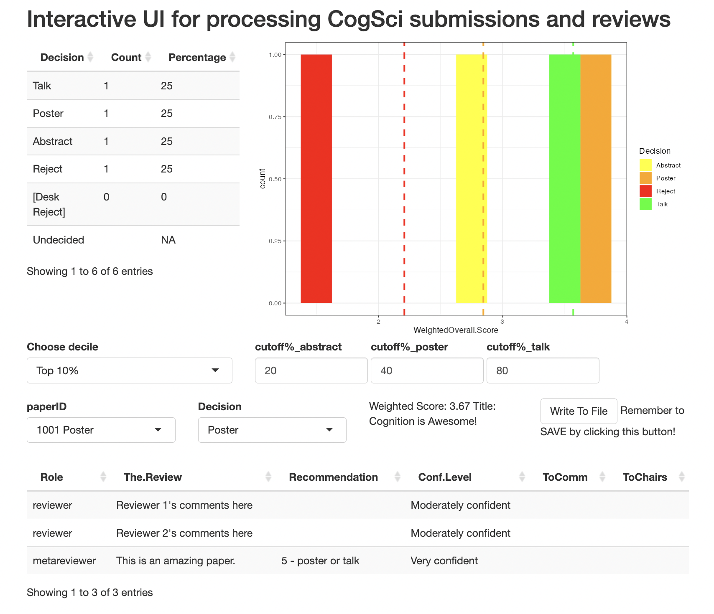
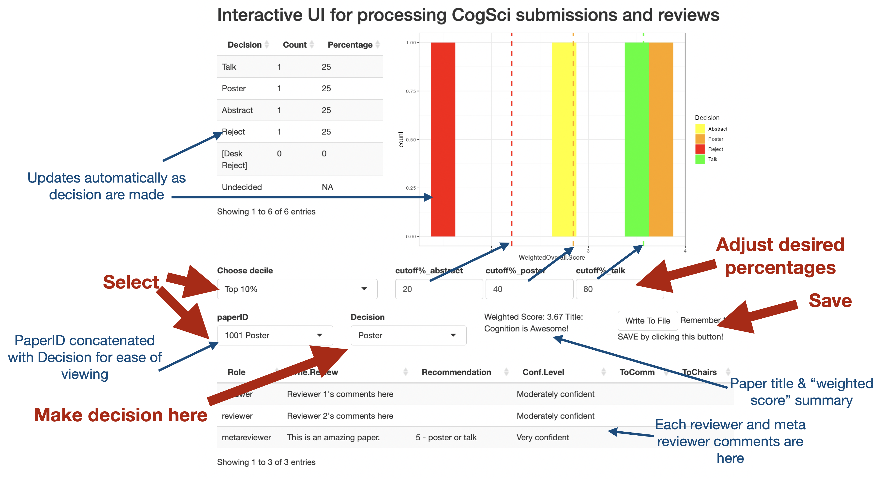

# pcs-analysis

R Shiny interface to analyze CogSci submission data from PCS (Precision Conference System).

This repository contains an R Shiny app that helps to simplify the process of making final CogSci decisions. This assumes that CogSci is still using PCS, the reviews and meta-reviews are in (or coming in), and organizing committee chairs want to get started on making decisions.

## Why this app?

The *manual* way is via the PCS website. You login, and you can see every paper. But it's really difficult to *sort* the papers (And everytime you load the `Submissions` page it takes a while as its pulling and refreshing data). It's great for looking at individual papers (or if you have 1-6 papers), but it's horrendous when you have 900 papers to go through. Moreover, as you are making your decisions, you have no way of keeping track of how many accepts you have had so far, as well as associated statistics (e.g., what is the mean scores of the "paper" decisions, etc.)

Compared to the PCS interface, this app interface allows you to select specific papers, see the reviews, put in a decision, and then see how that decision updates the distribution of scores. There's a table that provides a running update on the numbers of talks, numbers of posters, etc.

You'll need one co-chair who's somewhat familiar with R / RStudio to launch/host it.

## Basic setup

- RStudio has great support for Shiny. If you load the `.rmd` file in RStudio, you should have a "Run Document" button right at the top.
- The APP can be hosted on Shiny Apps https://shinyapps.io/
    - You can sign up for a free account, which allows up to 25 hours of app usage on the free tier. For CogSci2023 we used about 30+ hours, so I just signed up for the cheapest plan ($9/month). There might be a way to host this for free but *shrug* it wasn't too expensive.
    - The great thing about hosting it on Shiny Apps is that any of the other co-chairs (even those unfamiliar with R) can access the app. 
    - You need to run some code using rsconnect (code chunk below with instructions) to tell RStudio how to talk to your ShinyApps account.
- The DATA has to be stored in the cloud somewhere, as ShinyApps doesn't provide data storage. I chose to use Dropbox, using the `rdrop2` library. The person hosting it will have to run some code (in the next chunk) to generate an authentication token (`token.rds`) to allow the app to access their Dropbox.
- To deploy the app, just hit "Run Document", then in the top-right of the window there'll be a "Publish" (or "Re-publish") button. Just hit that, select which account, **make sure to select the `.rmd` file and the `token.rds` file**, and boom, you're done! 

If any of the co-chairs wants to run this locally on their own computer (saving some compute hours on ShinyApp), just send them this `.rmd` file and your `token.rds`. They can just load this `.rmd` in RStudio and go.

## Outline

- Once-off: Set up Shiny Apps (via the Shiny Apps website)
- Once-off: Set up Dropbox (via `rdrop2::drop_auth()`)
- Once-off/continuous: Get data from PCS (from two or more chairs)
	- There are various data cleaning steps
- Continuous: Using the app to make and track decisions

See the `.rmd` file for more details!

